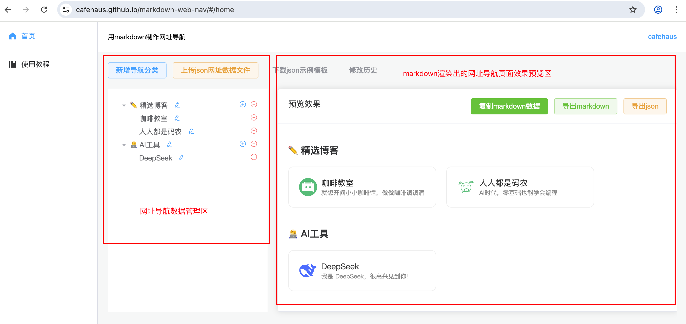

# markdown-web-nav

一个制作 markdown 语法网址导航页面的可视化网页工具，让普通用户也可以直接在上面新增编辑网站信息，然后自动生成出来我们需要的 markdown 数据，已实现的功能包括：

* 可以在网页上新增、编辑、删除需要的网址数据
* 通过导入json文件直接生成页面数据
* 实时预览最终的markdown渲染的网址导航效果
* 一键自动复制最终的markdown数据
* 导出页面数据到markdown文件、json文件
* 可记录最近的历史修改记录，方便回滚修改

### 使用 markdown-web-nav 工具制作网址导航页面步骤

制作出一个网址导航页面总共分为如下6个步骤，操作也很简单：

#### 1、打开 markdown-web-nav 网页工具
在浏览器中打开：[markdown-web-nav](https://cafehaus.github.io/markdown-web-nav)

网站内容区左侧为级联网址数据管理区，可以在这里新增、编辑、删除需要的网址数据。右侧为效果预览区，当我们修改了网址数据后，可以在这里实时查看到用markdown渲染出来一样的最终效果。



#### 2、上传json网址数据文件（可选）
对于程序员用户，可能更加习惯编写一份 json 数据，编写好后点击“上传json网址数据文件”按钮可直接上传数据，此时左侧数据和右侧预览效果都会自动边城 json 文件中对应的数据。


注意编写 json 数据时按按照特定的格式，对于导航分类必须设置 title，对于分类下的网站可以通过 name、url、icon、description 分别设置对应的信息，具体格式可参照“下载示例模板”中的 json 文件。

```json
{
  "root": [
    {
      "title": "✏️ 精选博客",
      "children": [
        {
          "name": "咖啡教室",
          "url": "https://cafe123.cn",
          "description": "就想开间小小咖啡馆，做做咖啡调调酒",
          "icon": "https://cafe123.cn/logo.svg"
        }
      ]
    },
    {
      "title": "🧑‍💻 AI工具",
      "children": [
        {
          "name": "DeepSeek",
          "url": "https://chat.deepseek.com",
          "description": "我是 DeepSeek，很高兴见到你！",
          "icon": "https://www.deepseek.com/favicon.ico"
        }
      ]
    }
  ]
}
```

当然，对于不习惯 json 模式的用户可以直接跳过此步骤，参考下面的第3步。

#### 3、新增导航分类
网址导航中的网站数据我们一般会进行分类，比如科技的放一块、美食的放一块...这里我们也需要先创建一个导航分类，在新增一个分类的同时我们需要同步添加一个网站导航数据。


#### 4、新增网站数据
添加好导航分类后我们就可以在分类下面添加网站数据了，直接点击左侧分类信息后面的➕号图标，可以在弹窗中填写具体的网站信息，其中网站名称和网站地址必填。

为了更加有辨识度和美观建议网站图标地址也填写上，如果不填写默认会用网站名称的第一个字符生成一个默认的圆形文字图标，对于不知道怎么获取网站对应图标的可以参考后面的常见问题章节。

进入网页后默认有几个示例数据，可以直接在示例的基础上修改、新增。点击分类和网站数据后面的编辑图标可以编辑详细信息，点击减号图标可以删除当前元素，点击分加号图标可以新增当前分类下的网站信息。


#### 5、复制 markdown 数据
数据添加完成后，可以点击右侧的“复制markdown数据”，直接将最终的markdown数据复制到粘贴板上。同时如果每次修改比较大时也建议点击“导出json“按钮备份一下，可将当前数据导出为一个json文件保存在自己电脑上，下次想再次修改时可以直接通过“上传json网址数据文件”加载回来之前的所有数据。


#### 6、粘贴到支持markdown内容渲染的文档页面中
上一步复制好markdown数据后，我们就可以在支持markdown渲染的文档中或者编辑器中粘贴进去。

如果想自己本地修改markdown数据，也可以直接选择“导出markdown”下载到本地再进行修改。

### 常见问题
#### 1、如何还原之前的数据？
制作好网址导航后，如果过了一段时间想要再次新增时，直接打开网站工具 [markdown-web-nav](https://cafehaus.github.io/markdown-web-nav) 后如何能加载回来之前的数据？

有两种方式：第一种通过事先下载好之前的json备份文件，再通过“上传json网址数据文件”可以加载回之前的数据。

第二种可以通过顶部的“修改历史”按钮选择之前的某个时间点的版本进行还原，可以鼠标放到顶部的“修改历史”按钮上，里面会记录我们最近的一些修改记录，点击某个修改时间可以加载对应时间点的修改数据，不过操作前建议先点“导出json”按钮将当前的数据备份到自己电脑本地，以防数据丢失。

第二种通过修改历史找回比较方便简单，不过依然建议大家每次同时下载 json 文件备份，因为修改历史记录有可能会存在数据丢失的问题。


#### 2、如何找到某个网站的 icon 图标链接？

大多网站使用的的图标就是在域名后面跟上如下的一些后缀：

* /favicon.ico
* /logo.png
* /logo.svg
* /images/logo.png

可以自己在浏览器中网址后面加上上面的后缀测试看能不能正常打开图片，如果打开失败也可以换后面一种办法。

在浏览器中打开我们需要的网址后，鼠标右键-检查（快捷键F12），会自动打开浏览器调试台，然后选到 network 后再刷新一下，浏览器会再次加载当前页面的所有资源，里面会有各种html、js、css、图片这些资源，然后从这些资源中去找到我们需要的图标，一般以 logo、favicon 这些命名，找到后再鼠标右键-Open in new tab，会自动在浏览器中打开，最后复制出来打开的浏览器页面地址。


#### 3、如何反馈问题？
有任何使用问题或建议可以在 github 对应仓库提 [issue](https://github.com/cafehaus/markdown-web-nav/issues)